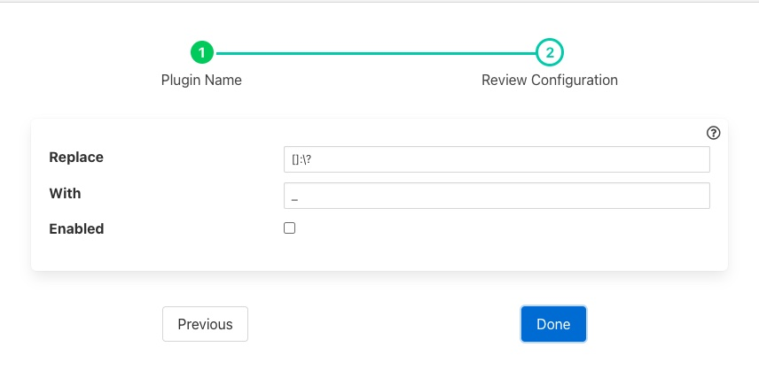

.. Images

Repalce Filter
======--======

The *fledge-filter-repalce* is a filter that allows an be used to repalce all occurance of a set of characters with a signel replacement character. This can be used to change specifal characters in the names of assets and datapoints.

+-----------+
| |replace| |
+-----------+

  - **Replace**: The set of characters to be replaced.

  - **With**: The character to replace each occurance of the above characters with

